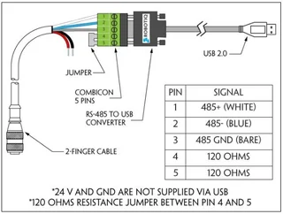
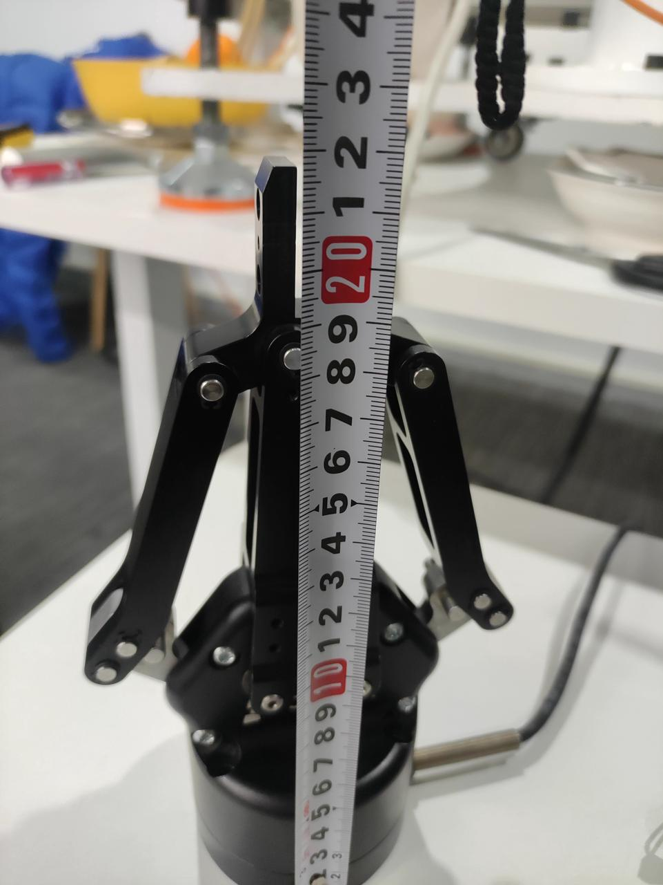
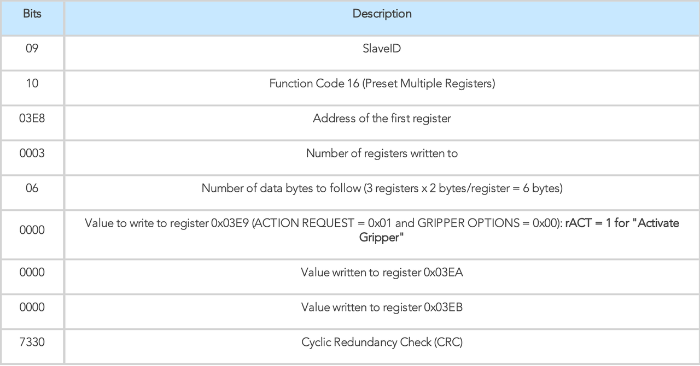
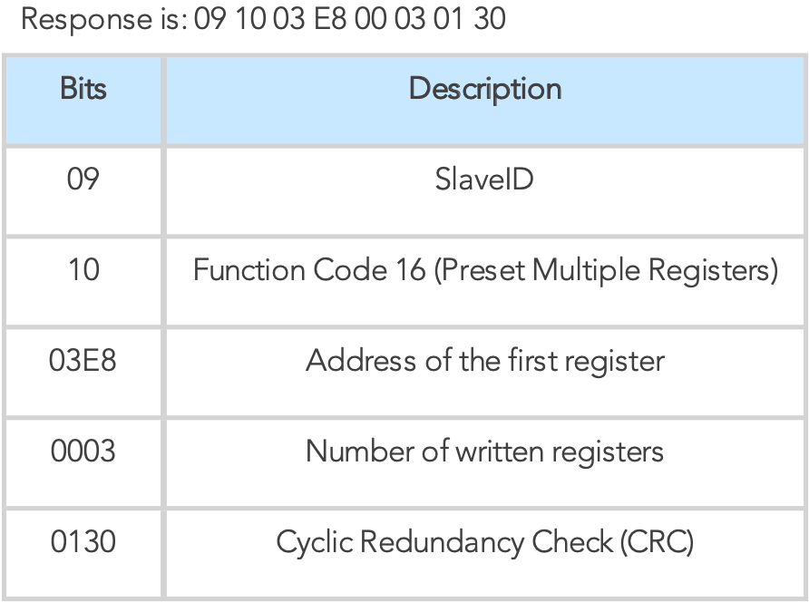
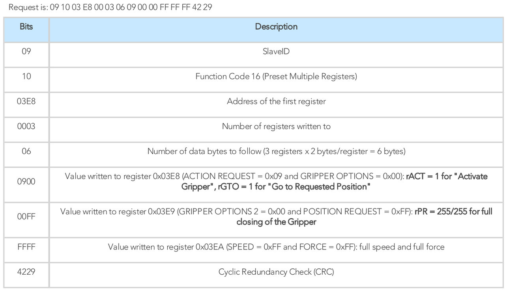

# Robotiq Gripper
## Hardware
+ Robotiq 2F 140
### Connection
Voltage Input: `24V`

USB to RS-485



Then connect the USB to the computer and control it directly through the serial port. After the power is connected, the indicator light is red, and then after connecting to the computer, the indicator light is blue when working. If the indicator light turns purple, there is a problem with the system and it needs to be restarted.

## Document
[Download Robotiq PDF]("Robotiq 2F-85-140.pdf")

## Gripper Length


## Install Dependencies
+ conda
```
conda install pyserial
```
+ pip
```
pip install pyserial    # python2
pip3 install pyserial   # python3
```
## Run
### 1. activate gripper
```
python gripper_activate.py
```
### 2. open gripper
```
python gripper_open.py
```
### 3. close gripper
```
python gripper_close.py
```

### 4. control gripper (windows)
```
python windows.py
```
## Driver
### Step 1: Activation Request (clear and set rACT) 
```
09 10 03 E8 00 03 06 00 00 00 00 00 00 73 30
```





### Step 2: Read Gripper status until the activation is completed (Not required for actual use)

### Step 3: Move the robot to the pick-up location

### Step 4: Close the Gripper at full speed and full force



position、velocity、force: ``FF FF FF``

The following ``4229`` is the check code, which needs to be calculated based on the previous HEX representation. The calculation format is hexadecimal (CRC16) (MODBUS RTU communication)

tool: https://www.23bei.com/tool/59.html

``Reference``: https://blog.robotiq.com/controlling-the-robotiq-2f-gripper-with-modbus-commands-in-python

## Close Gripper
### Force Control
1. Full Force
```
09 10 03 E8 00 03 06 09 00 00 FF FF FF 42 29
```
2. Half force
```
09 10 03 E8 00 03 06 09 00 00 FF FF 80 03 C9
```
### Pose Control
1. Controls the length of the gripper opening position. 
2. The maximum position is 255. When judging the opening position, the larger the value, the smaller the opening position.

There are some examples
```
# 50 / 255
self.ser.write(b'\x09\x10\x03\xE8\x00\x03\x06\x09\x00\x00\x32\xFF\xFF\xD3\xD6')
# 70 / 255
self.ser.write(b'\x09\x10\x03\xE8\x00\x03\x06\x09\x00\x00\x46\xFF\xFF\x93\xCC')
# 100 / 255
self.ser.write(b'\x09\x10\x03\xE8\x00\x03\x06\x09\x00\x00\x64\xFF\xFF\x33\xC6')
# 150 / 255
self.ser.write(b'\x09\x10\x03\xE8\x00\x03\x06\x09\x00\x00\x96\xFF\xFF\x92\x35')
```