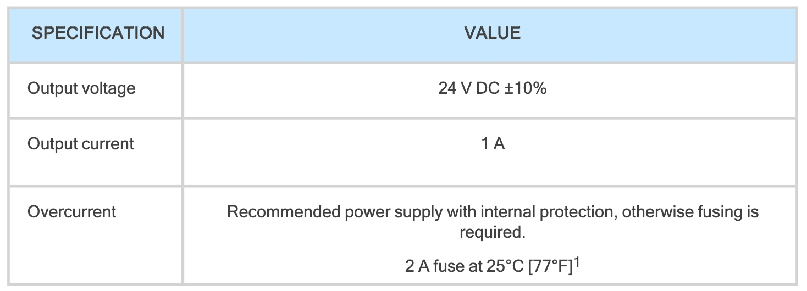
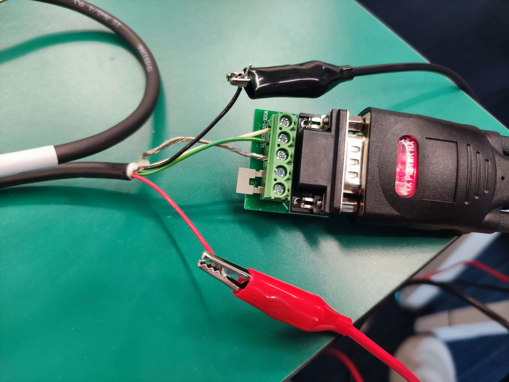

# Robotiq Gripper
## Hardware
+ Robotiq 2F-140
+ Robotiq Hand-E
### Connection
Voltage Input: `24V`

Current Input: `1A`

details see in `3.2 Required Tools and Equipment`



#### 1. 2F-140

USB to RS-485


#### 2. Hand-E


Then connect the USB to the computer and control it directly through the serial port. After the power is connected, the indicator light is red, and then after connecting to the computer, the indicator light is blue when working. If the indicator light turns purple, there is a problem with the system and it needs to be restarted.

## Document
Download Robotiq Gripper.pdf

## Gripper Length


## download the code
```
git clone https://github.com/ChangerC77/Robotiq-Gripper.git
```
## Install Dependencies
+ conda
```
conda install pyserial
```
+ pip
```
pip install pyserial    # python2
pip3 install pyserial   # python3
```
## Serial Port
### 1. check the serial port
```
ls -l /dev/ttyUSB0
```
output
```
crw-rw---- 1 root dialout 188, 0 3月   9 11:50 /dev/ttyUSB0
```
### 2. Serial port authorization
```
sudo chmod 777 /dev/ttyUSB0
ls -l /dev/ttyUSB0
```
output
```
crwxrwxrwx 1 root dialout 188, 0 3月   9 11:50 /dev/ttyUSB0
```

## Gripper Control
### 1. activate gripper
```
python gripper_activate.py
```
output
```
b'\t\x10\x03\xe8\x00\x03\x010'
activate response  b'091003e800030130'
```
### 2. open gripper
```
python gripper_open.py
```
output
```
opening the gripper
open gripper respons应  b'091003e800030130'
```
### 3. close gripper
```
python gripper_close.py
```
output
```
closing the gripper
close response  b'091003e800030130'
```
### 4. move gripper
```
python gripper_move.py
```
### 5. get info
```
python gripper_info.py
```
output
```
gOBJ_desc 的值是: Fingers have stopped due to a contact while closing before requested position. Object detected closing
物体检测状态 (gOBJ): 2
当前电流 (mA): 40 mA
当前夹爪位置: 168
```
### 6. tele with gello
```
python gripper_tele.py
```
### 7. tele with keyboard control
```
python gripper_keyboard.py
```
### 8. tactile closed-loop control and publish gripper position
```
python gripper_force_control.py
```
### 8. tactile closed-loop control and publish gripper position (ROS)
```
python gripper_force_control_node.py
```
## Tactile
### 1. publish tactile (R0S)
```
python tactile_pub.py
```
### 2. subscribe tactile (R0S)
```
python tactile_sub.py
``` 

## (windows system), you can control gripper
```
python windows.py
```
## Driver
### output the communication protocol


range: `0 - 255 -> 0 - FF`

`255, FF`: Full closed, velocity, force

```
python protocol.py
```
## Communication Protocol Method
### Step 1: Activation Request (clear and set rACT) 
```
09 10 03 E8 00 03 06 00 00 00 00 00 00 73 30
```


### Step 2: Close the Gripper at full speed and full force


The following ``4229`` is the check code, which needs to be calculated based on the previous HEX representation. The calculation format is hexadecimal `(CRC16)(MODBUS RTU communication)`

``Official Reference``: https://blog.robotiq.com/controlling-the-robotiq-2f-gripper-with-modbus-commands-in-python


## Close Gripper
### Force Control
#### 1. Full Force
```
09 10 03 E8 00 03 06 09 00 00 FF FF FF 42 29
```
#### 2. Half force
```
09 10 03 E8 00 03 06 09 00 00 FF FF 80 03 C9
```
### Position Control
#### 1. Controls the length of the gripper opening position. 
#### 2. The maximum position is `255`. When judging the opening position, the larger the value, the smaller the opening position.

There are some examples
```
# 50 / 255
self.ser.write(b'\x09\x10\x03\xE8\x00\x03\x06\x09\x00\x00\x32\xFF\xFF\xD3\xD6')
# 70 / 255
self.ser.write(b'\x09\x10\x03\xE8\x00\x03\x06\x09\x00\x00\x46\xFF\xFF\x93\xCC')
# 100 / 255
self.ser.write(b'\x09\x10\x03\xE8\x00\x03\x06\x09\x00\x00\x64\xFF\xFF\x33\xC6')
# 150 / 255
self.ser.write(b'\x09\x10\x03\xE8\x00\x03\x06\x09\x00\x00\x96\xFF\xFF\x92\x35')
```